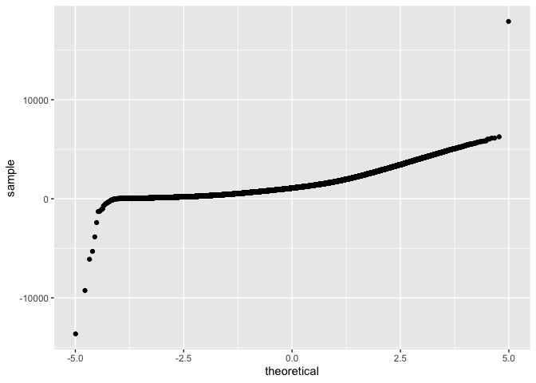
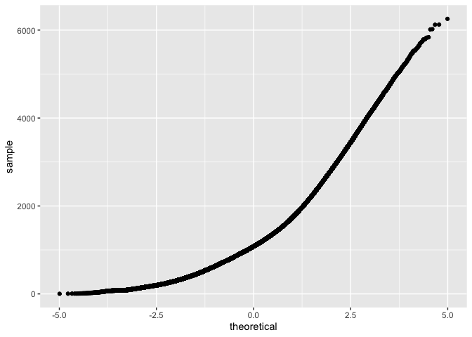
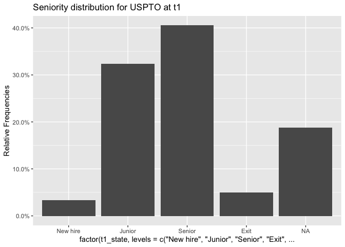
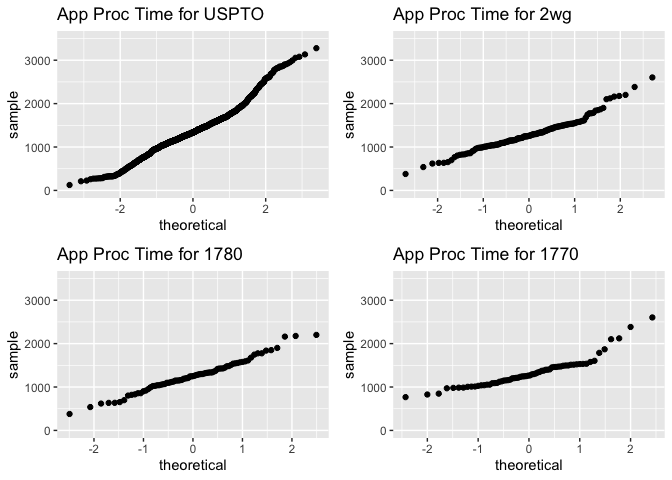
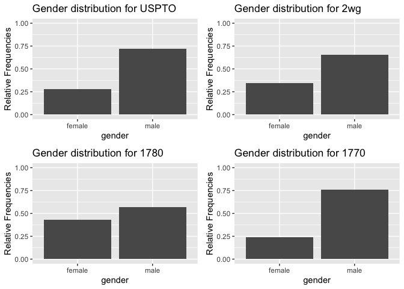

Final Report
================
Chelsea, Rebecca, Diwei, Dany

# 1. Introduction

The U.S. Patent and Trademark Office (USPTO) is the agency within the
U.S. Chamber of Commerce that issues patents and trademarks. It is one
in few organizations around the world to guarantee the intellectual
property rights or inventors. Although the organization plays an
important role in the capitalist society, it is now faced with many
challenges and criticisms that it needs to address.

One of the challenges is the time it takes examiners to process an
application. As the agency is fully funded by patent applications fees,
the focus should be to ensure a satisfactory “customer experience.”
However, when examiners take a long time to process applications, this
can be a frustrating experience for applicants. USPTO is now taking
action to improve its entire process by identifying the causes of
application backlogs.

Our goal is to understand what causes delays in processing times, which
characteristics makes examiners more efficient in their work and how can
network analysis solve the organizational difficulties that USPTO is
facing. We will focus on determining the organizational and social
factors associated with the length of patent application prosecution. We
will look at how examiner’s demographics (gender, race, tenure) are
related to their application processing time. We will also look at the
social advice network within the organization plays a role in improving
the patent application times and outcomes.

# 2. Methodology

1. Data Pre-processing
    a.  Data Engineering
    b.  Data Exploration
    c.  Data Cleaning
2. Examining Gender Effect
3. Examining Tenure Effect
4. Examining Race Effect

# 3. Analysis and Results

Load the applications data from ‘app\_data\_sample.parquet’ and edges
data from ‘edges\_sample.csv’

``` r
applications <- read_parquet("app_data_sample.parquet")
edges <- read_csv("edges_sample.csv")
```

    ## Rows: 32906 Columns: 4

    ## ── Column specification ────────────────────────────────────────────────────────
    ## Delimiter: ","
    ## chr  (1): application_number
    ## dbl  (2): ego_examiner_id, alter_examiner_id
    ## date (1): advice_date

    ## 
    ## ℹ Use `spec()` to retrieve the full column specification for this data.
    ## ℹ Specify the column types or set `show_col_types = FALSE` to quiet this message.

### Get gender for examiners

We’ll get gender based on the first name of the examiner, which is
recorded in the field `examiner_name_first`. We’ll use library `gender`
for that, relying on a modified version of their own
[example](https://cran.r-project.org/web/packages/gender/vignettes/predicting-gender.html).

Note that there are over 2 million records in the applications table –
that’s because there are many records for each examiner, as many as the
number of applications that examiner worked on during this time frame.
Our first step therefore is to get all *unique* names in a separate list
`examiner_names`. We will then guess gender for each one and will join
this table back to the original dataset. So, let’s get names without
repetition:

``` r
library(gender)
#install_genderdata_package() # only run this line the first time you use the package, to get data for it
# get a list of first names without repetitions
examiner_names <- applications %>% 
  distinct(examiner_name_first)
#examiner_names
```

Now let’s use function `gender()` as shown in the example for the
package to attach a gender and probability to each name and put the
results into the table `examiner_names_gender`

``` r
# get a table of names and gender
examiner_names_gender <- examiner_names %>% 
  do(results = gender(.$examiner_name_first, method = "ssa")) %>% 
  unnest(cols = c(results), keep_empty = TRUE) %>% 
  select(
    examiner_name_first = name,
    gender,
    proportion_female
  )
examiner_names_gender
```

    ## # A tibble: 1,822 × 3
    ##    examiner_name_first gender proportion_female
    ##    <chr>               <chr>              <dbl>
    ##  1 AARON               male              0.0082
    ##  2 ABDEL               male              0     
    ##  3 ABDOU               male              0     
    ##  4 ABDUL               male              0     
    ##  5 ABDULHAKIM          male              0     
    ##  6 ABDULLAH            male              0     
    ##  7 ABDULLAHI           male              0     
    ##  8 ABIGAIL             female            0.998 
    ##  9 ABIMBOLA            female            0.944 
    ## 10 ABRAHAM             male              0.0031
    ## # … with 1,812 more rows

Finally, let’s join that table back to our original applications data
and discard the temporary tables we have just created to reduce clutter
in our environment.

``` r
# remove extra colums from the gender table
examiner_names_gender <- examiner_names_gender %>% 
  select(examiner_name_first, gender)
# joining gender back to the dataset
applications <- applications %>% 
  left_join(examiner_names_gender, by = "examiner_name_first")
# cleaning up
#gc()
```

### Guess the examiner’s race

We’ll now use package `wru` to estimate likely race of an examiner. Just
like with gender, we’ll get a list of unique names first, only now we
are using surnames.

``` r
library(wru)
examiner_surnames <- applications %>% 
  select(surname = examiner_name_last) %>% 
  distinct()
#examiner_surnames
```

We’ll follow the instructions for the package outlined here
<https://github.com/kosukeimai/wru>.

``` r
examiner_race <- predict_race(voter.file = examiner_surnames, surname.only = T) %>% 
  as_tibble()
```

    ## [1] "Proceeding with surname-only predictions..."

    ## Warning in merge_surnames(voter.file): Probabilities were imputed for 698
    ## surnames that could not be matched to Census list.

``` r
#examiner_race
```

As you can see, we get probabilities across five broad US Census
categories: white, black, Hispanic, Asian and other. (Some of you may
correctly point out that Hispanic is not a race category in the US
Census, but these are the limitations of this package.)

Our final step here is to pick the race category that has the highest
probability for each last name and then join the table back to the main
applications table. See this example for comparing values across
columns: <https://www.tidyverse.org/blog/2020/04/dplyr-1-0-0-rowwise/>.
And this one for `case_when()` function:
<https://dplyr.tidyverse.org/reference/case_when.html>.

``` r
examiner_race <- examiner_race %>% 
  mutate(max_race_p = pmax(pred.asi, pred.bla, pred.his, pred.oth, pred.whi)) %>% 
  mutate(race = case_when(
    max_race_p == pred.asi ~ "asian",
    max_race_p == pred.bla ~ "black",
    max_race_p == pred.his ~ "hispanic",
    max_race_p == pred.oth ~ "other",
    max_race_p == pred.whi ~ "white",
    TRUE ~ NA_character_
  ))
examiner_race
```

    ## # A tibble: 3,806 × 8
    ##    surname    pred.whi pred.bla pred.his pred.asi pred.oth max_race_p race 
    ##    <chr>         <dbl>    <dbl>    <dbl>    <dbl>    <dbl>      <dbl> <chr>
    ##  1 HOWARD       0.643   0.295    0.0237   0.005     0.0333      0.643 white
    ##  2 YILDIRIM     0.861   0.0271   0.0609   0.0135    0.0372      0.861 white
    ##  3 HAMILTON     0.702   0.237    0.0245   0.0054    0.0309      0.702 white
    ##  4 MOSHER       0.947   0.00410  0.0241   0.00640   0.0185      0.947 white
    ##  5 BARR         0.827   0.117    0.0226   0.00590   0.0271      0.827 white
    ##  6 GRAY         0.687   0.251    0.0241   0.0054    0.0324      0.687 white
    ##  7 MCMILLIAN    0.359   0.574    0.0189   0.00260   0.0463      0.574 black
    ##  8 FORD         0.620   0.32     0.0237   0.0045    0.0313      0.620 white
    ##  9 STRZELECKA   0.666   0.0853   0.137    0.0797    0.0318      0.666 white
    ## 10 KIM          0.0252  0.00390  0.00650  0.945     0.0198      0.945 asian
    ## # … with 3,796 more rows

Let’s join the data back to the applications table.

``` r
# removing extra columns
examiner_race <- examiner_race %>% 
  select(surname,race)
applications <- applications %>% 
  left_join(examiner_race, by = c("examiner_name_last" = "surname"))
#gc()
```

### Examiner’s tenure

To figure out the timespan for which we observe each examiner in the
applications data, let’s find the first and the last observed date for
each examiner. We’ll first get examiner IDs and application dates in a
separate table, for ease of manipulation. We’ll keep examiner ID (the
field `examiner_id`), and earliest and latest dates for each application
(`filing_date` and `appl_status_date` respectively). We’ll use functions
in package `lubridate` to work with date and time values.

``` r
library(lubridate) # to work with dates
examiner_dates <- applications %>% 
  select(examiner_id, filing_date, appl_status_date) 
#examiner_dates
```

The dates look inconsistent in terms of formatting. Let’s make them
consistent. We’ll create new variables `start_date` and `end_date`.

``` r
examiner_dates <- examiner_dates %>% 
  mutate(start_date = ymd(filing_date), end_date = as_date(dmy_hms(appl_status_date)))
```

Let’s now identify the earliest and the latest date for each examiner
and calculate the difference in days, which is their tenure in the
organization.

``` r
examiner_dates <- examiner_dates %>% 
  group_by(examiner_id) %>% 
  summarise(
    earliest_date = min(start_date, na.rm = TRUE), 
    latest_date = max(end_date, na.rm = TRUE),
    tenure_days = interval(earliest_date, latest_date) %/% days(1)
    ) %>% 
  filter(year(latest_date)<2018)
#examiner_dates

## plot tenure
library(skimr)
examiner_dates %>% 
  select(earliest_date,latest_date,tenure_days) %>% 
  skim()
```

|                                                  |            |
|:-------------------------------------------------|:-----------|
| Name                                             | Piped data |
| Number of rows                                   | 5625       |
| Number of columns                                | 3          |
| \_\_\_\_\_\_\_\_\_\_\_\_\_\_\_\_\_\_\_\_\_\_\_   |            |
| Column type frequency:                           |            |
| Date                                             | 2          |
| numeric                                          | 1          |
| \_\_\_\_\_\_\_\_\_\_\_\_\_\_\_\_\_\_\_\_\_\_\_\_ |            |
| Group variables                                  | None       |

Data summary

**Variable type: Date**

| skim\_variable | n\_missing | complete\_rate | min        | max        | median     | n\_unique |
|:---------------|-----------:|---------------:|:-----------|:-----------|:-----------|----------:|
| earliest\_date |          0 |              1 | 2000-01-02 | 2016-03-03 | 2003-01-21 |      2322 |
| latest\_date   |          0 |              1 | 2000-09-14 | 2017-12-06 | 2017-05-19 |       870 |

**Variable type: numeric**

| skim\_variable | n\_missing | complete\_rate |    mean |      sd |  p0 |  p25 |  p50 |  p75 | p100 | hist  |
|:---------------|-----------:|---------------:|--------:|--------:|----:|-----:|-----:|-----:|-----:|:------|
| tenure\_days   |          0 |              1 | 4429.51 | 1795.54 |  27 | 3096 | 4912 | 6091 | 6518 | ▂▂▂▅▇ |

Joining back to the applications data.

``` r
applications <- applications %>% 
  left_join(examiner_dates, by = "examiner_id")
#rm(examiner_dates)
#gc()
```

### Create application processing time variable

``` r
attach(applications)
library(lubridate)

# compute the final decision date as either abandon date or patent issue date
application_dates <- applications %>% 
    mutate(decision_date = coalesce(abandon_date,patent_issue_date)) %>%
    select(application_number,filing_date, abandon_date, patent_issue_date, decision_date, examiner_id, examiner_art_unit, gender, race, tenure_days) %>%
    filter(!is.na(decision_date))

head(application_dates)
```

    ## # A tibble: 6 × 10
    ##   application_number filing_date abandon_date patent_issue_date decision_date
    ##   <chr>              <date>      <date>       <date>            <date>       
    ## 1 08284457           2000-01-26  NA           2003-02-18        2003-02-18   
    ## 2 08413193           2000-10-11  NA           2002-08-27        2002-08-27   
    ## 3 08531853           2000-05-17  NA           1997-03-04        1997-03-04   
    ## 4 08637752           2001-07-20  NA           2005-08-09        2005-08-09   
    ## 5 08682726           2000-04-10  2000-12-27   NA                2000-12-27   
    ## 6 08687412           2000-04-28  NA           2001-07-31        2001-07-31   
    ## # … with 5 more variables: examiner_id <dbl>, examiner_art_unit <dbl>,
    ## #   gender <chr>, race <chr>, tenure_days <dbl>

``` r
# compute the application processing time as the difference of filing date and decision date
application_dates <- application_dates %>% 
    #mutate(app_proc_time = decision_date - filing_date)
    mutate(app_proc_time = difftime(decision_date, filing_date, units = "days"))

head(application_dates) #1,688,716 applications
```

    ## # A tibble: 6 × 11
    ##   application_number filing_date abandon_date patent_issue_date decision_date
    ##   <chr>              <date>      <date>       <date>            <date>       
    ## 1 08284457           2000-01-26  NA           2003-02-18        2003-02-18   
    ## 2 08413193           2000-10-11  NA           2002-08-27        2002-08-27   
    ## 3 08531853           2000-05-17  NA           1997-03-04        1997-03-04   
    ## 4 08637752           2001-07-20  NA           2005-08-09        2005-08-09   
    ## 5 08682726           2000-04-10  2000-12-27   NA                2000-12-27   
    ## 6 08687412           2000-04-28  NA           2001-07-31        2001-07-31   
    ## # … with 6 more variables: examiner_id <dbl>, examiner_art_unit <dbl>,
    ## #   gender <chr>, race <chr>, tenure_days <dbl>, app_proc_time <drtn>

It seems some application processing time have negative value
abnormally. Let’s take a look at the distribution.

``` r
# plot the data distribution of application processing time
application_dates %>%
  ggplot(aes(sample = app_proc_time)) +
  geom_qq()
```

    ## Don't know how to automatically pick scale for object of type difftime. Defaulting to continuous.
    ## Don't know how to automatically pick scale for object of type difftime. Defaulting to continuous.

<!-- -->

``` r
# filter out negative and outlying application processing time
application_dates <- application_dates %>% 
    filter(app_proc_time>ddays(0)) %>% 
    filter(app_proc_time<ddays(10000))

head(application_dates) #1,688,672 applications
```

    ## # A tibble: 6 × 11
    ##   application_number filing_date abandon_date patent_issue_date decision_date
    ##   <chr>              <date>      <date>       <date>            <date>       
    ## 1 08284457           2000-01-26  NA           2003-02-18        2003-02-18   
    ## 2 08413193           2000-10-11  NA           2002-08-27        2002-08-27   
    ## 3 08637752           2001-07-20  NA           2005-08-09        2005-08-09   
    ## 4 08682726           2000-04-10  2000-12-27   NA                2000-12-27   
    ## 5 08687412           2000-04-28  NA           2001-07-31        2001-07-31   
    ## 6 08765941           2000-06-23  2001-08-22   NA                2001-08-22   
    ## # … with 6 more variables: examiner_id <dbl>, examiner_art_unit <dbl>,
    ## #   gender <chr>, race <chr>, tenure_days <dbl>, app_proc_time <drtn>

``` r
# plot again the data distribution of application processing time after cleaning
application_dates %>%
  ggplot(aes(sample = app_proc_time)) +
  geom_qq()
```

    ## Don't know how to automatically pick scale for object of type difftime. Defaulting to continuous.
    ## Don't know how to automatically pick scale for object of type difftime. Defaulting to continuous.

<!-- -->
Outliers are removed successfully.

### Get work group from art unit

``` r
# before we begin, get the workgroup from art unit as rounding down to digit tenth.
application_dates <- application_dates %>%
  mutate(wg = (application_dates$examiner_art_unit%/%10) * 10)

# Find out which is the dominating workgroup an examiner handled the applications for.
library(plyr)
```

    ## ------------------------------------------------------------------------------

    ## You have loaded plyr after dplyr - this is likely to cause problems.
    ## If you need functions from both plyr and dplyr, please load plyr first, then dplyr:
    ## library(plyr); library(dplyr)

    ## ------------------------------------------------------------------------------

    ## 
    ## Attaching package: 'plyr'

    ## The following objects are masked from 'package:dplyr':
    ## 
    ##     arrange, count, desc, failwith, id, mutate, rename, summarise,
    ##     summarize

    ## The following object is masked from 'package:purrr':
    ## 
    ##     compact

``` r
library(dplyr)
library(lubridate)
application_dates <- mutate(
  application_dates,
  period = case_when(
    filing_date<ymd("2007-01-01") ~ NA_character_,
    filing_date<ymd("2008-01-01") ~ "t0",
    filing_date<ymd("2009-01-01") ~ "t1",
    filing_date<ymd("2010-01-01") ~ "t2",
    filing_date<ymd("2011-01-01") ~ "t3",
    filing_date<ymd("2012-01-01") ~ "t4",
    filing_date<ymd("2013-01-01") ~ "t5",
    filing_date<ymd("2014-01-01") ~ "t6",
    filing_date<ymd("2015-01-01") ~ "t7",
    filing_date<ymd("2016-01-01") ~ "t8",
    TRUE~ NA_character_)
  )

# get number of applications
library(plyr)
examiner_wg_napp <- ddply(application_dates, .(examiner_id, period, wg), nrow)
names(examiner_wg_napp) <- c("examiner_id","period", "wg", "n_applications")

# assume an examiner belong to the wg he/she most frequently handled applications for, if tie take the greater wg
examiner_wg_napp <- examiner_wg_napp[order(examiner_wg_napp$examiner_id, examiner_wg_napp$period, -(examiner_wg_napp$n_applications), -(examiner_wg_napp$wg)), ] ### sort first
examiner_wg <- examiner_wg_napp [!duplicated(examiner_wg_napp[c(1,2)]),]
examiner_wg <- select(examiner_wg, c("examiner_id","wg","period"))
examiner_wg <- drop_na(examiner_wg)
```

### Get seniority at each period

Let’s assume a time period of *t*<sub>0</sub> = 2007 (the year we first
get senior examiners, according to our definition),
*t*<sub>1</sub> = 2008, *t*<sub>2</sub> = 2009, *t*<sub>3</sub> = 2010,
*t*<sub>4</sub> = 2011, *t*<sub>5</sub> = 2012, *t*<sub>6</sub> = 2013,
*t*<sub>7</sub> = 2014, *t*<sub>8</sub> = 2015

``` r
# Get tenure & state at each period
examiner_dates <- examiner_dates %>% 
  mutate(
    tenure_t0 = ifelse(as.duration(earliest_date %--% ymd("2007-01-01")) / dyears(1)<0,0,as.duration(earliest_date %--% ymd("2007-01-01"))/dyears(1)),
    tenure_t1 = ifelse(as.duration(earliest_date %--% ymd("2008-01-01")) / dyears(1)<0,0,as.duration(earliest_date %--% ymd("2008-01-01"))/dyears(1)),
    tenure_t2 = ifelse(as.duration(earliest_date %--% ymd("2009-01-01")) / dyears(1)<0,0,as.duration(earliest_date %--% ymd("2009-01-01"))/dyears(1)),
    tenure_t3 = ifelse(as.duration(earliest_date %--% ymd("2010-01-01")) / dyears(1)<0,0,as.duration(earliest_date %--% ymd("2010-01-01"))/dyears(1)),
    tenure_t4 = ifelse(as.duration(earliest_date %--% ymd("2011-01-01")) / dyears(1)<0,0,as.duration(earliest_date %--% ymd("2011-01-01"))/dyears(1)),
    tenure_t5 = ifelse(as.duration(earliest_date %--% ymd("2012-01-01")) / dyears(1)<0,0,as.duration(earliest_date %--% ymd("2012-01-01"))/dyears(1)),
    tenure_t6 = ifelse(as.duration(earliest_date %--% ymd("2013-01-01")) / dyears(1)<0,0,as.duration(earliest_date %--% ymd("2013-01-01"))/dyears(1)),
    tenure_t7 = ifelse(as.duration(earliest_date %--% ymd("2014-01-01")) / dyears(1)<0,0,as.duration(earliest_date %--% ymd("2014-01-01"))/dyears(1)),
    tenure_t8 = ifelse(as.duration(earliest_date %--% ymd("2015-01-01")) / dyears(1)<0,0,as.duration(earliest_date %--% ymd("2015-01-01"))/dyears(1)),

    t0_state = case_when(
      tenure_t0<6 & tenure_t0>0 ~ "Junior"  , # Jr; not those yet to be hired!
      tenure_t0>=6              ~ "Senior"  , # Sr
      TRUE                      ~ NA_character_ # not yet hired
    ),
    t1_state = case_when(
      latest_date<ymd("2008-12-31")        ~ "Exit",
      earliest_date>ymd("2007-01-01") 
        & earliest_date<ymd("2008-01-01") ~ "New hire",
      tenure_t1<6 & tenure_t1>0          ~ "Junior"  , # Jr; not those yet to be hired!
      tenure_t1>=6                       ~ "Senior"  , # Sr
      TRUE                               ~ NA_character_ # not yet hired
      ),
    t2_state = case_when(
      t1_state=="Exit"                   ~ NA_character_,
      latest_date<ymd("2009-12-31")        ~ "Exit",
      earliest_date>ymd("2008-01-01") 
        & earliest_date<ymd("2009-01-01") ~ "New hire",
      tenure_t2<6 & tenure_t2>0          ~ "Junior"  , # Jr; not those yet to be hired!
      tenure_t2>=6                       ~ "Senior"  , # Sr
      TRUE                               ~ NA_character_ # not yet hired or already exit in previous period
      ),
    t3_state = case_when(
      t1_state=="Exit"|t2_state=="Exit"                   ~ NA_character_,
      latest_date<ymd("2010-12-31")        ~ "Exit",
      earliest_date>ymd("2009-01-01") 
        & earliest_date<ymd("2010-01-01") ~ "New hire",
      tenure_t3<6 & tenure_t3>0          ~ "Junior"  , # Jr; not those yet to be hired!
      tenure_t3>=6                       ~ "Senior"  , # Sr
      TRUE                               ~ NA_character_ # not yet hired or already exit in previous period
      ),
    t4_state = case_when(
      t1_state=="Exit"|t2_state=="Exit"|t3_state=="Exit"                   ~ NA_character_,
      latest_date<ymd("2011-12-31")        ~ "Exit",
      earliest_date>ymd("2010-01-01") 
        & earliest_date<ymd("2011-01-01") ~ "New hire",
      tenure_t4<6 & tenure_t4>0          ~ "Junior"  , # Jr; not those yet to be hired!
      tenure_t4>=6                       ~ "Senior"  , # Sr
      TRUE                               ~ NA_character_ # not yet hired or already exit in previous period
      ),
    t5_state = case_when(
      t1_state=="Exit"|t2_state=="Exit"|t3_state=="Exit"|t4_state=="Exit"                   ~ NA_character_,
      latest_date<ymd("2012-12-31")        ~ "Exit",
      earliest_date>ymd("2011-01-01") 
        & earliest_date<ymd("2012-01-01") ~ "New hire",
      tenure_t5<6 & tenure_t5>0          ~ "Junior"  , # Jr; not those yet to be hired!
      tenure_t5>=6                       ~ "Senior"  , # Sr
      TRUE                               ~ NA_character_ # not yet hired or already exit in previous period
      ),
    t6_state = case_when(
      t1_state=="Exit"|t2_state=="Exit"|t3_state=="Exit"|t4_state=="Exit"|t5_state=="Exit"                   ~ NA_character_,
      latest_date<ymd("2013-12-31")        ~ "Exit",
      earliest_date>ymd("2012-01-01") 
        & earliest_date<ymd("2013-01-01") ~ "New hire",
      tenure_t6<6 & tenure_t6>0          ~ "Junior"  , # Jr; not those yet to be hired!
      tenure_t6>=6                       ~ "Senior"  , # Sr
      TRUE                               ~ NA_character_ # not yet hired or already exit in previous period
      ),
    t7_state = case_when(
      t1_state=="Exit"|t2_state=="Exit"|t3_state=="Exit"|t4_state=="Exit"|t5_state=="Exit"|t6_state=="Exit"                   ~ NA_character_,
      latest_date<ymd("2014-12-31")        ~ "Exit",
      earliest_date>ymd("2013-01-01") 
        & earliest_date<ymd("2014-01-01") ~ "New hire",
      tenure_t7<6 & tenure_t7>0          ~ "Junior"  , # Jr; not those yet to be hired!
      tenure_t7>=6                       ~ "Senior"  , # Sr
      TRUE                               ~ NA_character_ # not yet hired or already exit in previous period
      ),
    t8_state = case_when(
      t1_state=="Exit"|t2_state=="Exit"|t3_state=="Exit"|t4_state=="Exit"|t5_state=="Exit"|t6_state=="Exit"|t7_state=="Exit"                   ~ NA_character_,
      latest_date<ymd("2015-12-31")        ~ "Exit",
      earliest_date>ymd("2014-01-01") 
        & earliest_date<ymd("2015-01-01") ~ "New hire",
      tenure_t8<6 & tenure_t8>0          ~ "Junior"  , # Jr; not those yet to be hired!
      tenure_t8>=6                       ~ "Senior"  , # Sr
      TRUE                               ~ NA_character_ # not yet hired or already exit in previous period
      )
    )

examiner_dates <- examiner_dates %>% 
  select(examiner_id, t0_state, t1_state, t2_state, t3_state, t4_state, t5_state, t6_state, t7_state, t8_state)

## plot seniority
library(ggplot2)
library(scales)  
```

    ## 
    ## Attaching package: 'scales'

    ## The following object is masked from 'package:purrr':
    ## 
    ##     discard

    ## The following object is masked from 'package:readr':
    ## 
    ##     col_factor

``` r
library(gridExtra)
```

    ## 
    ## Attaching package: 'gridExtra'

    ## The following object is masked from 'package:dplyr':
    ## 
    ##     combine

``` r
plot1 <- ggplot(examiner_dates, aes(factor(t1_state, levels = c("New hire", "Junior", "Senior", "Exit", NA)))) + 
          geom_bar(aes(y = (..count..)/sum(..count..))) + 
          scale_y_continuous(labels=scales::percent) +
          ylab("Relative Frequencies") +
          ggtitle("Seniority distribution for USPTO at t1")
plot1
```

<!-- -->

Joining back to the applications dates data.

``` r
application_dates <- application_dates %>% 
  left_join(examiner_dates, by = "examiner_id")
#gc()
```

### Generate examiner panel dataset

``` r
# compute average application processing time

cols <- c("examiner_id","period", "wg", "examiner_art_unit","gender", "race", "tenure_days",
          "t0_state","t1_state","t2_state","t3_state","t4_state","t5_state","t6_state","t7_state","t8_state")

examiners <- application_dates %>%
    group_by(across(all_of(cols))) %>%
    dplyr::summarize(mean_app_proc_time = mean(app_proc_time, na.rm=TRUE), n_app = n()) %>%
    drop_na()
```

    ## `summarise()` has grouped output by 'examiner_id', 'period', 'wg', 'examiner_art_unit', 'gender', 'race', 'tenure_days', 't0_state', 't1_state', 't2_state', 't3_state', 't4_state', 't5_state', 't6_state', 't7_state'. You can override using the `.groups` argument.

``` r
head(data.frame(examiners))
```

    ##   examiner_id period   wg examiner_art_unit gender  race tenure_days t0_state
    ## 1       59012     t0 1710              1716   male white        4013   Junior
    ## 2       59012     t0 1710              1717   male white        4013   Junior
    ## 3       59012     t1 1710              1716   male white        4013   Junior
    ## 4       59012     t1 1710              1717   male white        4013   Junior
    ## 5       59012     t3 1710              1716   male white        4013   Junior
    ## 6       59056     t0 2120              2124   male asian        6268   Senior
    ##   t1_state t2_state t3_state t4_state t5_state t6_state t7_state t8_state
    ## 1   Junior   Junior   Junior   Senior   Senior   Senior   Senior     Exit
    ## 2   Junior   Junior   Junior   Senior   Senior   Senior   Senior     Exit
    ## 3   Junior   Junior   Junior   Senior   Senior   Senior   Senior     Exit
    ## 4   Junior   Junior   Junior   Senior   Senior   Senior   Senior     Exit
    ## 5   Junior   Junior   Junior   Senior   Senior   Senior   Senior     Exit
    ## 6   Senior   Senior   Senior   Senior   Senior   Senior   Senior   Senior
    ##   mean_app_proc_time n_app
    ## 1      1232.312 days    32
    ## 2      1379.429 days    14
    ## 3      1003.286 days     7
    ## 4      1131.000 days    10
    ## 5       273.000 days     1
    ## 6      1740.000 days     1

#### Create panel dataset of examiners for analysis

``` r
# subset examiners for time period t1 for our analysis, as advice dates are all in 2008 
examiner_aus <- data.frame(examiners) %>%
    filter(period == "t1") %>% 
    #filter(wg == 2450 | wg == 2480) %>%
    select(wg, examiner_art_unit, examiner_id, gender, race, t1_state, tenure_days, mean_app_proc_time, n_app) %>%
    distinct(examiner_id, .keep_all=TRUE) %>% 
    drop_na() 

head(examiner_aus) #2591
```

    ##     wg examiner_art_unit examiner_id gender  race t1_state tenure_days
    ## 1 1710              1716       59012   male white   Junior        4013
    ## 2 2120              2124       59056   male asian   Senior        6268
    ## 3 2450              2455       59130   male asian   Senior        6323
    ## 4 1780              1787       59133   male white   Junior        4573
    ## 5 2160              2169       59141 female asian   Junior        4582
    ## 6 2160              2162       59181 female black   Senior        6331
    ##   mean_app_proc_time n_app
    ## 1     1003.2857 days     7
    ## 2     1445.5000 days     2
    ## 3      998.4737 days    38
    ## 4     1934.8065 days    31
    ## 5     1839.5556 days    18
    ## 6     1324.6038 days    53

### Compute centrality of examiners

``` r
# separate from edges examiners seek and give advice
edges_aus <- edges %>%
  filter(ego_examiner_id %in% examiner_aus$examiner_id) %>%
  filter(alter_examiner_id %in% examiner_aus$examiner_id) %>%
  drop_na() #8824

# merge work group information
network <- left_join(edges_aus, examiner_aus, by = c("ego_examiner_id" = "examiner_id"))
colnames(network)[5] <- "ego_examiner_wg"
colnames(network)[6] <- "ego_examiner_au"
colnames(network)[7] <- "ego_examiner_gender"
colnames(network)[8] <- "ego_examiner_race"
colnames(network)[9] <- "ego_examiner_t1_state"
colnames(network)[10] <- "ego_examiner_tenure"
colnames(network)[11] <- "ego_examiner_appprooctime"
colnames(network)[12] <- "ego_examiner_napp"
#network <- subset(network, select = -c(period))
network <- left_join(network, examiner_aus, by = c("alter_examiner_id" = "examiner_id"))
colnames(network)[13] <- "alter_examiner_wg"
colnames(network)[14] <- "alter_examiner_au"
colnames(network)[15] <- "alter_examiner_gender"
colnames(network)[16] <- "alter_examiner_race"
colnames(network)[17] <- "alter_examiner_t1_state"
#colnames(network)[18] <- "alter_examiner_tenure"
colnames(network)[19] <- "alter_examiner_appprooctime"
colnames(network)[20] <- "alter_examiner_napp"
#network <- subset(network, select = -c(period))

head(network)
```

    ## # A tibble: 6 × 20
    ##   application_number advice_date ego_examiner_id alter_examiner_… ego_examiner_wg
    ##   <chr>              <date>                <dbl>            <dbl>           <dbl>
    ## 1 09402488           2008-11-17            84356            63519            1650
    ## 2 09445135           2008-08-21            92953            91818            2420
    ## 3 09484331           2008-02-07            72253            61519            1630
    ## 4 09484331           2008-02-07            72253            72253            1630
    ## 5 09489652           2008-01-10            67078            75772            2190
    ## 6 09489652           2008-01-10            67078            97328            2190
    ## # … with 15 more variables: ego_examiner_au <dbl>, ego_examiner_gender <chr>,
    ## #   ego_examiner_race <chr>, ego_examiner_t1_state <chr>,
    ## #   ego_examiner_tenure <dbl>, ego_examiner_appprooctime <drtn>,
    ## #   ego_examiner_napp <int>, alter_examiner_wg <dbl>, alter_examiner_au <dbl>,
    ## #   alter_examiner_gender <chr>, alter_examiner_race <chr>,
    ## #   alter_examiner_t1_state <chr>, tenure_days <dbl>,
    ## #   alter_examiner_appprooctime <drtn>, alter_examiner_napp <int>

``` r
# Visualize the advice seeking volume by examiner seniority in period t1
  network %>% 
  group_by(ego_examiner_t1_state, alter_examiner_t1_state) %>% 
  dplyr::summarise(count = n())
```

    ## `summarise()` has grouped output by 'ego_examiner_t1_state'. You can override using the `.groups` argument.

    ## # A tibble: 4 × 3
    ## # Groups:   ego_examiner_t1_state [2]
    ##   ego_examiner_t1_state alter_examiner_t1_state count
    ##   <chr>                 <chr>                   <int>
    ## 1 Junior                Junior                    827
    ## 2 Junior                Senior                   3862
    ## 3 Senior                Junior                    373
    ## 4 Senior                Senior                   3762

There are more junior seeking advice from senior than peer advice
seeking (junior to junior, senior to senior). It is the fewest for
senior to seek advice from junior.

``` r
# create edge list
edge_list <- select(network, c("ego_examiner_id","alter_examiner_id")) #8824

# create node list
ego <- select(network, c("ego_examiner_id","ego_examiner_wg")) %>%
    dplyr::rename(id=ego_examiner_id, wg=ego_examiner_wg)
alter <- select(network, c("alter_examiner_id","alter_examiner_wg")) %>%
    dplyr::rename(id=alter_examiner_id, wg=alter_examiner_wg)
nodes <- rbind(ego, alter) %>%
  select(id) %>%
  distinct() %>%
  drop_na() #1447

# create advice net
library(igraph)
```

    ## 
    ## Attaching package: 'igraph'

    ## The following objects are masked from 'package:lubridate':
    ## 
    ##     %--%, union

    ## The following objects are masked from 'package:dplyr':
    ## 
    ##     as_data_frame, groups, union

    ## The following objects are masked from 'package:purrr':
    ## 
    ##     compose, simplify

    ## The following object is masked from 'package:tidyr':
    ## 
    ##     crossing

    ## The following object is masked from 'package:tibble':
    ## 
    ##     as_data_frame

    ## The following objects are masked from 'package:stats':
    ## 
    ##     decompose, spectrum

    ## The following object is masked from 'package:base':
    ## 
    ##     union

``` r
advice_net = graph_from_data_frame(d=edge_list, vertices=nodes, directed=TRUE)
```

``` r
# calculate Degree Centrality, a measure for a node in a network is just its degree, the number of edges connected to it. 
V(advice_net)$dc <- degree(advice_net)
# calculate Betweenness Centrality, which measures the extent to which a node lies on paths between other nodes.
V(advice_net)$bc <- betweenness(advice_net)
# calculate Eigenvector Centrality, which awards a number of points proportional to the centrality scores of the neighbors
V(advice_net)$ec <- evcent(advice_net)$vector
V(advice_net)$cc <- closeness(advice_net) # dropped since closeness centrality is not well-defined for disconnected graphs
```

    ## Warning in closeness(advice_net): At centrality.c:2874 :closeness centrality is
    ## not well-defined for disconnected graphs

``` r
# combine the centrality scores
centrality <- data.frame(cbind(nodes$id, V(advice_net)$dc, V(advice_net)$bc, V(advice_net)$ec, V(advice_net)$cc)) 
colnames(centrality)[1] <- "examiner_id"
colnames(centrality)[2] <- "degree_centrality"
colnames(centrality)[3] <- "betweenness_centrality"
colnames(centrality)[4] <- "eigenvector_centrality"
colnames(centrality)[5] <- "closeness_centrality"
head(centrality)
```

    ##   examiner_id degree_centrality betweenness_centrality eigenvector_centrality
    ## 1       84356                17             22.0000000           3.117146e-10
    ## 2       92953                 1              0.0000000           1.935144e-18
    ## 3       72253                28             94.0000000           7.153520e-11
    ## 4       67078                 2              0.0000000           1.177571e-08
    ## 5       91688                12              0.7936508           5.901232e-10
    ## 6       61797                25              0.0000000           4.146497e-07
    ##   closeness_centrality
    ## 1         4.802518e-07
    ## 2         4.785900e-07
    ## 3         4.795848e-07
    ## 4         4.795853e-07
    ## 5         4.782593e-07
    ## 6         5.569789e-07

``` r
# merge centrality to examiners
examiner_joined <- left_join(examiner_aus, centrality, by = c("examiner_id" = "examiner_id"))
examiner_joined <- examiner_joined %>%
  drop_na(degree_centrality)
head(examiner_joined) #1447
```

    ##     wg examiner_art_unit examiner_id gender  race t1_state tenure_days
    ## 1 2120              2124       59056   male asian   Senior        6268
    ## 2 2160              2169       59141 female asian   Junior        4582
    ## 3 2160              2162       59181 female black   Senior        6331
    ## 4 1640              1644       59211   male white   Senior        6332
    ## 5 1730              1734       59227 female white   Senior        6349
    ## 6 1650              1652       59236 female white   Senior        6331
    ##   mean_app_proc_time n_app degree_centrality betweenness_centrality
    ## 1      1445.500 days     2                 9                      0
    ## 2      1839.556 days    18                 7                      0
    ## 3      1324.604 days    53                17                      0
    ## 4      1044.125 days    56                21                      1
    ## 5      1270.418 days    91                 4                      0
    ## 6      1369.680 days    50                 2                      0
    ##   eigenvector_centrality closeness_centrality
    ## 1           1.951991e-07         4.779288e-07
    ## 2           1.221788e-06         4.785903e-07
    ## 3           6.445086e-05         4.779288e-07
    ## 4           2.212934e-10         4.782593e-07
    ## 5           5.042884e-13         4.779288e-07
    ## 6           4.941850e-12         4.779288e-07

### Work groups selection (applicable for analysis zoom-in)

``` r
# select the workgroups under the same technology centre with most examiners at t1 for our analysis, as advice dates are all in 2008
examiner_joined %>% 
  #dplyr::filter(period == "t1") %>% 
  count("wg") %>% 
  arrange(desc(freq)) %>%
  head(4)
```

    ##     wg freq
    ## 1 2440   84
    ## 2 1780   79
    ## 3 1640   71
    ## 4 1770   66

Hence, we’re selecting work groups 1780 and 1770 under the same
technology centre 1700 for further analysis.

``` r
examiner_joined_1780 = examiner_joined[examiner_joined$wg==1780,]
examiner_joined_1770 = examiner_joined[examiner_joined$wg==1770,]

examiner_joined_2wg <- examiner_joined %>%
  filter(wg == 1780 | wg == 1770)
```

### 3.1 Organization and social factors associated with the length of patent application prosecution

Before we begin, let’s take a look at the distribution of application
processing time for the selected examiners.

``` r
# plot the data distribution of application processing time
plot1 <- examiner_joined %>% ggplot(aes(sample = mean_app_proc_time)) + geom_qq() + labs(title="App Proc Time for USPTO") + ylim(0,3500)
plot2 <- examiner_joined_2wg %>% ggplot(aes(sample = mean_app_proc_time)) + geom_qq() + labs(title="App Proc Time for 2wg") + ylim(0,3500)
plot3 <- examiner_joined_1780 %>% ggplot(aes(sample = mean_app_proc_time)) + geom_qq() + labs(title="App Proc Time for 1780") + ylim(0,3500)
plot4 <- examiner_joined_1770 %>% ggplot(aes(sample = mean_app_proc_time)) + geom_qq() + labs(title="App Proc Time for 1770") + ylim(0,3500)
grid.arrange(plot1,plot2,plot3,plot4, ncol=2, widths=c(1,1))
```

    ## Don't know how to automatically pick scale for object of type difftime. Defaulting to continuous.
    ## Don't know how to automatically pick scale for object of type difftime. Defaulting to continuous.
    ## Don't know how to automatically pick scale for object of type difftime. Defaulting to continuous.
    ## Don't know how to automatically pick scale for object of type difftime. Defaulting to continuous.

<!-- --> We can
see that the two selected work groups under the same technology centre
have lower application processing time than USTPO company as a whole.
Comparatively, 1780 demonstrates more similar distribution as
company-wide, while work group 1770 has even shorter application proc
time in general but slightly more outliers towards the higher end. Given
the low sample size (79 examiners for 1780 and 66 examiners for 1770),
the data limitation shall be acknowledged.

Also we would like to understand the network for the two selected work
groups.

``` r
nodes <- left_join(nodes, examiner_joined, by = c("id" = "examiner_id")) %>% select(id,wg,examiner_art_unit)
nodes_2wg <- nodes %>% filter(wg == 1780 | wg == 1770)
edge_list_2wg <- edge_list %>% filter(ego_examiner_id %in% nodes_2wg$id) %>% filter(alter_examiner_id %in% nodes_2wg$id)
advice_net_2wg = graph_from_data_frame(d=edge_list_2wg, vertices=nodes_2wg, directed=TRUE)

V(advice_net_2wg)$dc <- degree(advice_net_2wg)

library(ggraph)
ggraph(advice_net_2wg, layout="kk") +
  geom_edge_link()+
  geom_node_point(aes(size=dc, color=nodes_2wg$examiner_art_unit), show.legend=T)
```

<!-- -->

#### 3.1.1 Impacts of centrality

As a consulting team, we would like to analyze how examiners’ gender is
associated with the length of the patent application processing time.
Here we would focus on both the USPTO organizational level and selected
work groups levels in t1 period.

Firstly, we run 4 linear regression models on organizational level to
understand the effect of each centrality measure to the application
process time separately.

``` r
#install.packages("stargazer")
library(stargazer)
```

    ## 
    ## Please cite as:

    ##  Hlavac, Marek (2018). stargazer: Well-Formatted Regression and Summary Statistics Tables.

    ##  R package version 5.2.2. https://CRAN.R-project.org/package=stargazer

``` r
reg1 = lm(as.numeric(mean_app_proc_time)~degree_centrality,data=examiner_joined)
reg2 = lm(as.numeric(mean_app_proc_time)~betweenness_centrality,data=examiner_joined)
reg3 = lm(as.numeric(mean_app_proc_time)~eigenvector_centrality,data=examiner_joined)
reg4 = lm(as.numeric(mean_app_proc_time)~closeness_centrality,data=examiner_joined)

stargazer(reg1,reg2,reg3,reg4,type="text", title="Impacts of Each Centrality Measure to Application Processing Time (USPTO level)")
```

    ## 
    ## Impacts of Each Centrality Measure to Application Processing Time (USPTO level)
    ## ==========================================================================================
    ##                                                    Dependent variable:                    
    ##                                 ----------------------------------------------------------
    ##                                               as.numeric(mean_app_proc_time)              
    ##                                     (1)          (2)          (3)              (4)        
    ## ------------------------------------------------------------------------------------------
    ## degree_centrality                  -0.101                                                 
    ##                                   (0.629)                                                 
    ##                                                                                           
    ## betweenness_centrality                          -0.013                                    
    ##                                                (0.014)                                    
    ##                                                                                           
    ## eigenvector_centrality                                      272.252                       
    ##                                                            (467.882)                      
    ##                                                                                           
    ## closeness_centrality                                                   1,312,375,648.000**
    ##                                                                         (542,030,078.000) 
    ##                                                                                           
    ## Constant                        1,365.962*** 1,366.274*** 1,364.533***     726.228***     
    ##                                   (14.502)     (12.400)     (12.308)        (263.998)     
    ##                                                                                           
    ## ------------------------------------------------------------------------------------------
    ## Observations                       1,447        1,447        1,447            1,447       
    ## R2                                0.00002       0.001        0.0002           0.004       
    ## Adjusted R2                        -0.001      -0.00003     -0.0005           0.003       
    ## Residual Std. Error (df = 1445)   468.042      467.891      467.992          467.100      
    ## F Statistic (df = 1; 1445)         0.026        0.960        0.339           5.862**      
    ## ==========================================================================================
    ## Note:                                                          *p<0.1; **p<0.05; ***p<0.01

Both degree centrality and betweenness centrality have a negative
relation to the mean application processing time. Adding one more unit
in degree centrality and betweenness centrality subtract, on average,
mean application processing time by 0.101 days and 0.013 days
respectively, if holding everything else equal. The higher these
centrality scores, the faster the application processing.

Both eigenvector centrality and closesness centrality (ranged from 0 to
1) have a positive relation to the mean application processing time.
Adding 0.1 more unit in eigenvector centrality adds mean application
processing time by 27.2 days and adding 0.1 more unit in eigenvector
centrality adds mean application processing time by 1.3e08 days, if
holding everything else equal. The higher these centrality scores, the
slower the application processing. This means having relationship with
examiners who have high scores would take longer processing time,
potentially due to more workload assigned, and the more distant an
examiner is with other examiners, the more the longer the processing
time, potentially due to lack of peer support.

Now, let’s take a look at the correlation of the 4 centrality measures
and run a regression to understand the effect of the centrality measure
to the application process time together.

``` r
library(ggcorrplot)
quantvars <- examiner_joined %>% select(mean_app_proc_time, tenure_days, n_app, degree_centrality, betweenness_centrality, eigenvector_centrality, closeness_centrality)
quantvars$mean_app_proc_time = as.numeric(quantvars$mean_app_proc_time)
# populating correlation matrix
corr_matrix = cor(quantvars)
ggcorrplot(corr_matrix)
```

<!-- --> From
the correlation matrix we can see that the target variable
app\_proc\_time has no strong correlation with other numeric variables.
The centrality measures have strong correlation with each other -
relatively stronger for degree centrality with all other measures and
slightly stronger correlation between betweenness centrality and
closeness centrality.

Then, we look into all measures in one linear regression model and
observed consistent results - an increase in degree centrality and
betweenness centrality reduces application processing time while an in
crease in eigenvector centrality and closeness centrality increases
application processing time.

``` r
reg5 = lm(as.numeric(mean_app_proc_time)~degree_centrality+betweenness_centrality+eigenvector_centrality+closeness_centrality,data=examiner_joined)
stargazer(reg1,reg2,reg3,reg4,reg5,type="text", title="Impacts of Centrality Measure Separately and Combined to Application Processing Time (USPTO level)")
```

    ## 
    ## Impacts of Centrality Measure Separately and Combined to Application Processing Time (USPTO level)
    ## ==================================================================================================================================
    ##                                                                    Dependent variable:                                            
    ##                        -----------------------------------------------------------------------------------------------------------
    ##                                                              as.numeric(mean_app_proc_time)                                       
    ##                                (1)                  (2)                  (3)                   (4)                    (5)         
    ## ----------------------------------------------------------------------------------------------------------------------------------
    ## degree_centrality             -0.101                                                                                -0.223        
    ##                              (0.629)                                                                                (0.677)       
    ##                                                                                                                                   
    ## betweenness_centrality                             -0.013                                                           -0.023        
    ##                                                   (0.014)                                                           (0.015)       
    ##                                                                                                                                   
    ## eigenvector_centrality                                                 272.252                                      317.346       
    ##                                                                       (467.882)                                    (474.120)      
    ##                                                                                                                                   
    ## closeness_centrality                                                                   1,312,375,648.000**   1,591,292,250.000*** 
    ##                                                                                         (542,030,078.000)      (567,266,041.000)  
    ##                                                                                                                                   
    ## Constant                   1,365.962***         1,366.274***         1,364.533***           726.228***             595.606**      
    ##                              (14.502)             (12.400)             (12.308)             (263.998)              (274.896)      
    ##                                                                                                                                   
    ## ----------------------------------------------------------------------------------------------------------------------------------
    ## Observations                  1,447                1,447                1,447                 1,447                  1,447        
    ## R2                           0.00002               0.001                0.0002                0.004                  0.006        
    ## Adjusted R2                   -0.001              -0.00003             -0.0005                0.003                  0.004        
    ## Residual Std. Error    468.042 (df = 1445)  467.891 (df = 1445)  467.992 (df = 1445)   467.100 (df = 1445)    467.048 (df = 1442) 
    ## F Statistic            0.026 (df = 1; 1445) 0.960 (df = 1; 1445) 0.339 (df = 1; 1445) 5.862** (df = 1; 1445) 2.296* (df = 4; 1442)
    ## ==================================================================================================================================
    ## Note:                                                                                                  *p<0.1; **p<0.05; ***p<0.01

Next, we will repeat the steps for the two selected work groups.

``` r
reg1 = lm(as.numeric(mean_app_proc_time)~degree_centrality,data=examiner_joined_2wg)
reg2 = lm(as.numeric(mean_app_proc_time)~betweenness_centrality,data=examiner_joined_2wg)
reg3 = lm(as.numeric(mean_app_proc_time)~eigenvector_centrality,data=examiner_joined_2wg)
reg4 = lm(as.numeric(mean_app_proc_time)~closeness_centrality,data=examiner_joined_2wg)
reg5 = lm(as.numeric(mean_app_proc_time)~degree_centrality+betweenness_centrality+eigenvector_centrality+closeness_centrality,data=examiner_joined_2wg)
stargazer(reg1,reg2,reg3,reg4,reg5,type="text", title="Impacts of Centrality Measure Separately and Combined to Application Processing Time (2wg level)")
```

    ## 
    ## Impacts of Centrality Measure Separately and Combined to Application Processing Time (2wg level)
    ## ==========================================================================================================================
    ##                                                                Dependent variable:                                        
    ##                        ---------------------------------------------------------------------------------------------------
    ##                                                          as.numeric(mean_app_proc_time)                                   
    ##                                (1)                 (2)                 (3)                 (4)                 (5)        
    ## --------------------------------------------------------------------------------------------------------------------------
    ## degree_centrality            -2.070                                                                          -1.844       
    ##                              (1.406)                                                                         (1.475)      
    ##                                                                                                                           
    ## betweenness_centrality                            0.053                                                       0.129       
    ##                                                  (1.061)                                                     (1.066)      
    ##                                                                                                                           
    ## eigenvector_centrality                                            -761,768.900                            -733,900.600    
    ##                                                                  (2,758,323.000)                         (2,765,540.000)  
    ##                                                                                                                           
    ## closeness_centrality                                                               -1,763,717,185.000  -1,136,894,823.000 
    ##                                                                                    (1,844,022,311.000) (1,922,483,285.000)
    ##                                                                                                                           
    ## Constant                  1,313.860***        1,289.150***        1,290.221***         2,140.211**         1,859.320**    
    ##                             (33.791)            (30.620)            (29.793)            (889.912)           (923.550)     
    ##                                                                                                                           
    ## --------------------------------------------------------------------------------------------------------------------------
    ## Observations                   145                 145                 145                 145                 145        
    ## R2                            0.015              0.00002              0.001               0.006               0.018       
    ## Adjusted R2                   0.008              -0.007              -0.006              -0.001              -0.010       
    ## Residual Std. Error    354.887 (df = 143)  357.564 (df = 143)  357.471 (df = 143)  356.429 (df = 143)  358.119 (df = 140) 
    ## F Statistic            2.168 (df = 1; 143) 0.003 (df = 1; 143) 0.076 (df = 1; 143) 0.915 (df = 1; 143) 0.640 (df = 4; 140)
    ## ==========================================================================================================================
    ## Note:                                                                                          *p<0.1; **p<0.05; ***p<0.01

Unlike company level, all centrality measures except betweenness
centrality reduce application process time for the two selected work
groups. This finding is consistent across running regression separately
and combined.

Degree centrality, eigenvector centrality and closeness centrality have
a negative relation to the mean application processing time. Adding one
more unit of degree centrality subtract, on average, mean application
processing time by 1.84 days and adding 0.1 unit of eigenvector
centrality and closeness centrality add 7.33e04 days and 1.14e08
respectively, if holding everything else equal. The higher these
centrality scores, the faster the application processing.

Only betweenness centrality have a positive relation to the mean
application processing time. Adding 0.1 more unit in eigenvector
centrality adds mean application processing time by 0.129 days, if
holding everything else equal. This means having relationship with
examiners who have high has the greatest influence over the flow of
information between seats would take longer processing time, potentially
due to some bottleneck or centralized review needed within the work
groups.

Overall, the effect of centrality is greater for work groups 2450 and
2480 than in the entire USPTO organization. This is potentially due to
the nature of applications that require more communications,
collaborations and advice seeking in specific domain subjects. This is
in line with the work group shortlisting approach taken in our
methodology.

#### 3.1.2 Impacts of examiners’ gender

Now that we have a general idea on the relationship of centrality
measures to application processing, we can overlay different dimensions
on top and evaluate if there is different level of impacts. We will
focus on the 2 work groups 1780 and 1770 shortlisted and begin with
examiner’s gender in t1 period.

``` r
# male
examiner_joined_2wg_m <- examiner_joined_2wg %>%
  filter(gender == "male")

reg1 = lm(as.numeric(mean_app_proc_time)~degree_centrality,data=examiner_joined_2wg_m)
reg2 = lm(as.numeric(mean_app_proc_time)~betweenness_centrality,data=examiner_joined_2wg_m)
reg3 = lm(as.numeric(mean_app_proc_time)~eigenvector_centrality,data=examiner_joined_2wg_m)
reg4 = lm(as.numeric(mean_app_proc_time)~closeness_centrality,data=examiner_joined_2wg_m)
reg5 = lm(as.numeric(mean_app_proc_time)~degree_centrality+betweenness_centrality+eigenvector_centrality+closeness_centrality,data=examiner_joined_2wg_m)
stargazer(reg1,reg2,reg3,reg4,reg5,type="text", title="Impacts of Centrality Measure Separately and Combined to Application Processing Time (2wg level, male)")
```

    ## 
    ## Impacts of Centrality Measure Separately and Combined to Application Processing Time (2wg level, male)
    ## ========================================================================================================================
    ##                                                               Dependent variable:                                       
    ##                        -------------------------------------------------------------------------------------------------
    ##                                                         as.numeric(mean_app_proc_time)                                  
    ##                               (1)                (2)                 (3)                 (4)                 (5)        
    ## ------------------------------------------------------------------------------------------------------------------------
    ## degree_centrality            -2.165                                                                        -1.894       
    ##                             (1.558)                                                                        (1.697)      
    ##                                                                                                                         
    ## betweenness_centrality                          0.684                                                       0.859       
    ##                                                (1.182)                                                     (1.194)      
    ##                                                                                                                         
    ## eigenvector_centrality                                       -2,174,175,755.000                      -1,507,154,635.000 
    ##                                                              (2,231,984,952.000)                     (2,345,267,965.000)
    ##                                                                                                                         
    ## closeness_centrality                                                             -1,310,550,071.000   -388,030,640.000  
    ##                                                                                  (2,256,989,357.000) (2,349,671,706.000)
    ##                                                                                                                         
    ## Constant                  1,289.814***       1,261.027***       1,273.747***         1,897.334*           1,473.949     
    ##                             (38.318)           (35.235)           (35.298)           (1,088.681)         (1,128.982)    
    ##                                                                                                                         
    ## ------------------------------------------------------------------------------------------------------------------------
    ## Observations                   95                 95                 95                  95                  95         
    ## R2                           0.020              0.004               0.010               0.004               0.030       
    ## Adjusted R2                  0.010              -0.007             -0.001              -0.007              -0.013       
    ## Residual Std. Error    332.245 (df = 93)  335.075 (df = 93)   333.978 (df = 93)   335.070 (df = 93)   336.005 (df = 90) 
    ## F Statistic            1.931 (df = 1; 93) 0.334 (df = 1; 93) 0.949 (df = 1; 93)  0.337 (df = 1; 93)  0.705 (df = 4; 90) 
    ## ========================================================================================================================
    ## Note:                                                                                        *p<0.1; **p<0.05; ***p<0.01

``` r
# female
examiner_joined_2wg_f <- examiner_joined_2wg %>%
  filter(gender == "female")

reg1 = lm(as.numeric(mean_app_proc_time)~degree_centrality,data=examiner_joined_2wg_f)
reg2 = lm(as.numeric(mean_app_proc_time)~betweenness_centrality,data=examiner_joined_2wg_f)
reg3 = lm(as.numeric(mean_app_proc_time)~eigenvector_centrality,data=examiner_joined_2wg_f)
reg4 = lm(as.numeric(mean_app_proc_time)~closeness_centrality,data=examiner_joined_2wg_f)
reg5 = lm(as.numeric(mean_app_proc_time)~degree_centrality+betweenness_centrality+eigenvector_centrality+closeness_centrality,data=examiner_joined_2wg_f)
stargazer(reg1,reg2,reg3,reg4,reg5,type="text", title="Impacts of Centrality Measure Separately and Combined to Application Processing Time (2wg level, female)")
```

    ## 
    ## Impacts of Centrality Measure Separately and Combined to Application Processing Time (2wg level, female)
    ## =======================================================================================================================
    ##                                                              Dependent variable:                                       
    ##                        ------------------------------------------------------------------------------------------------
    ##                                                         as.numeric(mean_app_proc_time)                                 
    ##                               (1)                (2)                (3)                 (4)                 (5)        
    ## -----------------------------------------------------------------------------------------------------------------------
    ## degree_centrality            -2.031                                                                       -1.487       
    ##                             (2.944)                                                                       (3.134)      
    ##                                                                                                                        
    ## betweenness_centrality                          -1.581                                                    -1.549       
    ##                                                (2.183)                                                    (2.237)      
    ##                                                                                                                        
    ## eigenvector_centrality                                         -1,133,026.000                         -1,271,400.000   
    ##                                                               (3,096,228.000)                         (3,159,762.000)  
    ##                                                                                                                        
    ## closeness_centrality                                                            -2,506,844,397.000  -1,992,146,951.000 
    ##                                                                                 (3,205,125,562.000) (3,422,545,629.000)
    ##                                                                                                                        
    ## Constant                  1,361.097***       1,347.836***       1,338.181***         2,545.286           2,331.557     
    ##                             (67.569)           (58.790)           (56.951)          (1,548.189)         (1,641.995)    
    ##                                                                                                                        
    ## -----------------------------------------------------------------------------------------------------------------------
    ## Observations                   50                 50                 50                 50                  50         
    ## R2                           0.010              0.011              0.003               0.013               0.031       
    ## Adjusted R2                  -0.011             -0.010             -0.018             -0.008              -0.055       
    ## Residual Std. Error    397.121 (df = 48)  396.922 (df = 48)  398.528 (df = 48)   396.564 (df = 48)   405.756 (df = 45) 
    ## F Statistic            0.476 (df = 1; 48) 0.524 (df = 1; 48) 0.134 (df = 1; 48) 0.612 (df = 1; 48)  0.359 (df = 4; 45) 
    ## =======================================================================================================================
    ## Note:                                                                                       *p<0.1; **p<0.05; ***p<0.01

It is interesting to observe that the degree centrality effect in
reducing application processing time is more in males (adding one more
unit subtracts application processing time by 1.89 days) than females
(subtracts 1.48 days) and the betweenness centrality effect adds
application processing for male but reduces application processing time
for female. This shows the different strengths and preferences on how to
get applications processed by gender. Male examiners are more good at
building cohesive network that all examiners know each other well, while
female examiners are more good at bridging network that they have close
examiners in different groups who don’t know each other well. Also,
bridging network seems to be more effective in reducing application
processing time for female examiners while it could be
counter-productive for male.

To better understand potential reasons and control for other
characteristics of examiner that might influence the relationship, let’s
take a look at the distribution of gender on company level and work
group level.

``` r
library(ggplot2)
library(scales)  
library(gridExtra)

plot1 <- ggplot(examiner_joined, aes(gender)) + 
          geom_bar(aes(y = (..count..)/sum(..count..))) + 
          scale_y_continuous(labels=scales::percent) +
          ylab("Relative Frequencies") + ylim(0,1) +
          ggtitle("Gender distribution for USPTO")
```

    ## Scale for 'y' is already present. Adding another scale for 'y', which will
    ## replace the existing scale.

``` r
plot2 <- ggplot(examiner_joined_2wg, aes(gender)) + 
          geom_bar(aes(y = (..count..)/sum(..count..))) + 
          scale_y_continuous(labels=scales::percent) +
          ylab("Relative Frequencies") + ylim(0,1) +
          ggtitle("Gender distribution for 2wg")
```

    ## Scale for 'y' is already present. Adding another scale for 'y', which will
    ## replace the existing scale.

``` r
plot3 <- ggplot(examiner_joined_1780, aes(gender)) + 
          geom_bar(aes(y = (..count..)/sum(..count..))) + 
          scale_y_continuous(labels=scales::percent) +
          ylab("Relative Frequencies") + ylim(0,1) +
          ggtitle("Gender distribution for 1780")
```

    ## Scale for 'y' is already present. Adding another scale for 'y', which will
    ## replace the existing scale.

``` r
plot4 <- ggplot(examiner_joined_1770, aes(gender)) + 
          geom_bar(aes(y = (..count..)/sum(..count..))) + 
          scale_y_continuous(labels=scales::percent) +
          ylab("Relative Frequencies") + ylim(0,1) +
          ggtitle("Gender distribution for 1770")
```

    ## Scale for 'y' is already present. Adding another scale for 'y', which will
    ## replace the existing scale.

``` r
grid.arrange(plot1,plot2,plot3,plot4,ncol=2, widths=c(1,1))
```

<!-- -->

It is observed that there is systematic bias in gender for USPTO and
selected work groups that there are more male examiners than female.
Among the 2 selected work group, 1780 has better gender balance and 1770
has worse gender balance when compared to company-level. Gender shall be
taken into consideration in the formulation of regression overall.

Let’s repeat running the regression with interaction terms of gender and
centrality. This time we’re going to take a more micro-view per each of
the selected work groups as their gender distributions are so different.

``` r
# 1780, gender x centrality
reg1 = lm(as.numeric(mean_app_proc_time)~degree_centrality+as.factor(gender)+degree_centrality*as.factor(gender),data=examiner_joined_1780)
reg2 = lm(as.numeric(mean_app_proc_time)~betweenness_centrality+as.factor(gender)+betweenness_centrality*as.factor(gender),data=examiner_joined_1780)
reg3 = lm(as.numeric(mean_app_proc_time)~eigenvector_centrality+as.factor(gender)+eigenvector_centrality*as.factor(gender),data=examiner_joined_1780)
reg4 = lm(as.numeric(mean_app_proc_time)~closeness_centrality+as.factor(gender)+closeness_centrality*as.factor(gender),data=examiner_joined_1780)
reg5 = lm(as.numeric(mean_app_proc_time)~degree_centrality+betweenness_centrality+eigenvector_centrality+closeness_centrality+as.factor(gender)+degree_centrality*as.factor(gender)+betweenness_centrality*as.factor(gender)+eigenvector_centrality*as.factor(gender)+closeness_centrality*as.factor(gender),data=examiner_joined_1780)
stargazer(reg1,reg2,reg3,reg4,reg5,type="text", title="Impacts of Centrality Measure Separately and Combined to Application Processing Time (1780 wg level, centrality x gender)")
```

    ## 
    ## Impacts of Centrality Measure Separately and Combined to Application Processing Time (1780 wg level, centrality x gender)
    ## ===============================================================================================================================================
    ##                                                                                     Dependent variable:                                        
    ##                                              --------------------------------------------------------------------------------------------------
    ##                                                                                as.numeric(mean_app_proc_time)                                  
    ##                                                     (1)                 (2)                 (3)                 (4)                 (5)        
    ## -----------------------------------------------------------------------------------------------------------------------------------------------
    ## degree_centrality                                  -2.103                                                                         -0.261       
    ##                                                   (4.027)                                                                         (4.496)      
    ##                                                                                                                                                
    ## betweenness_centrality                                               -12.228**                                                   -12.012*      
    ##                                                                       (5.812)                                                     (6.140)      
    ##                                                                                                                                                
    ## eigenvector_centrality                                                                 -969,034.100                           -1,481,198.000   
    ##                                                                                       (2,896,574.000)                         (2,901,398.000)  
    ##                                                                                                                                                
    ## closeness_centrality                                                                                    -2,300,268,739.000   -895,906,878.000  
    ##                                                                                                         (3,038,678,695.000) (3,412,273,921.000)
    ##                                                                                                                                                
    ## as.factor(gender)male                             -81.692            -169.128*            -87.309           -1,156.557          -1,692.842     
    ##                                                  (102.450)           (87.792)            (86.849)           (2,069.662)         (2,394.764)    
    ##                                                                                                                                                
    ## degree_centrality:as.factor(gender)male            -0.818                                                                         -4.140       
    ##                                                   (4.621)                                                                         (5.870)      
    ##                                                                                                                                                
    ## betweenness_centrality:as.factor(gender)male                         13.354**                                                    13.349**      
    ##                                                                       (5.960)                                                     (6.291)      
    ##                                                                                                                                                
    ## eigenvector_centrality:as.factor(gender)male                                        -4,060,405,818.000                       1,923,445,218.000 
    ##                                                                                     (5,006,380,957.000)                     (7,685,871,709.000)
    ##                                                                                                                                                
    ## closeness_centrality:as.factor(gender)male                                                               2,185,261,518.000   3,245,876,923.000 
    ##                                                                                                         (4,273,146,757.000) (5,010,232,175.000)
    ##                                                                                                                                                
    ## Constant                                        1,339.215***       1,373.178***        1,317.188***          2,427.751           1,815.083     
    ##                                                   (80.164)           (68.066)            (64.610)           (1,473.418)         (1,627.677)    
    ##                                                                                                                                                
    ## -----------------------------------------------------------------------------------------------------------------------------------------------
    ## Observations                                         79                 79                  79                  79                  79         
    ## R2                                                 0.042               0.081               0.027               0.025               0.114       
    ## Adjusted R2                                        0.004               0.044              -0.011              -0.014              -0.001       
    ## Residual Std. Error                          368.157 (df = 75)   360.689 (df = 75)   370.976 (df = 75)   371.455 (df = 75)   369.063 (df = 69) 
    ## F Statistic                                  1.101 (df = 3; 75) 2.193* (df = 3; 75) 0.706 (df = 3; 75)  0.639 (df = 3; 75)  0.991 (df = 9; 69) 
    ## ===============================================================================================================================================
    ## Note:                                                                                                               *p<0.1; **p<0.05; ***p<0.01

Looking into work group 1780 which has better gender balance, the effect
of different centrality measures to mean application time separately in
the 1st to 4th regression is consistent with combining them together for
evaluation in the 5th regression. Increase in any of the four centrality
measures can reduce the application processing time. Being a male
examiner subtracts, on average, mean application processing time by 1693
days, if holding everything else equal. The interaction terms of gender
x centrality has shown that being a male examiner, the effect of degree
centrality is negative and the effect of betweenness centrality is
positive in relation to the mean application processing time - this
supports the robustness of our above finding per gender that male
examiners are more good at building cohesive network while female
examiners are more good at bridging network.

``` r
# 1770, gender x centrality
reg1 = lm(as.numeric(mean_app_proc_time)~degree_centrality+as.factor(gender)+degree_centrality*as.factor(gender),data=examiner_joined_1770)
reg2 = lm(as.numeric(mean_app_proc_time)~betweenness_centrality+as.factor(gender)+betweenness_centrality*as.factor(gender),data=examiner_joined_1770)
reg3 = lm(as.numeric(mean_app_proc_time)~eigenvector_centrality+as.factor(gender)+eigenvector_centrality*as.factor(gender),data=examiner_joined_1770)
reg4 = lm(as.numeric(mean_app_proc_time)~closeness_centrality+as.factor(gender)+closeness_centrality*as.factor(gender),data=examiner_joined_1770)
reg5 = lm(as.numeric(mean_app_proc_time)~degree_centrality+betweenness_centrality+eigenvector_centrality+closeness_centrality+as.factor(gender)+degree_centrality*as.factor(gender)+betweenness_centrality*as.factor(gender)+eigenvector_centrality*as.factor(gender)+closeness_centrality*as.factor(gender),data=examiner_joined_1770)
stargazer(reg1,reg2,reg3,reg4,reg5,type="text", title="Impacts of Centrality Measure Separately and Combined to Application Processing Time (1770 wg level, centrality x gender)")
```

    ## 
    ## Impacts of Centrality Measure Separately and Combined to Application Processing Time (1770 wg level, centrality x gender)
    ## ===================================================================================================================================================
    ##                                                                                       Dependent variable:                                          
    ##                                              ------------------------------------------------------------------------------------------------------
    ##                                                                                  as.numeric(mean_app_proc_time)                                    
    ##                                                     (1)                (2)                  (3)                  (4)                   (5)         
    ## ---------------------------------------------------------------------------------------------------------------------------------------------------
    ## degree_centrality                                  -2.091                                                                            -2.348        
    ##                                                   (3.485)                                                                            (3.773)       
    ##                                                                                                                                                    
    ## betweenness_centrality                                                -0.439                                                         -1.255        
    ##                                                                      (2.057)                                                         (4.496)       
    ##                                                                                                                                                    
    ## eigenvector_centrality                                                              -48,691,824,239.000                        122,650,134,594.000 
    ##                                                                                    (298,629,772,020.000)                      (656,665,360,538.000)
    ##                                                                                                                                                    
    ## closeness_centrality                                                                                       -668,763,612.000    -3,166,589,569.000  
    ##                                                                                                          (47,488,018,473.000) (50,501,008,207.000) 
    ##                                                                                                                                                    
    ## as.factor(gender)male                             -96.222            -68.288              -71.332             1,176.078             -274.339       
    ##                                                  (112.294)          (104.892)            (108.328)           (22,841.610)         (24,305.100)     
    ##                                                                                                                                                    
    ## degree_centrality:as.factor(gender)male            1.652                                                                              2.003        
    ##                                                   (4.322)                                                                            (4.621)       
    ##                                                                                                                                                    
    ## betweenness_centrality:as.factor(gender)male                          -2.443                                                         -1.524        
    ##                                                                      (5.508)                                                         (6.972)       
    ##                                                                                                                                                    
    ## eigenvector_centrality:as.factor(gender)male                                        47,059,521,594.000                        -123,737,605,640.000 
    ##                                                                                    (298,641,577,776.000)                      (656,671,687,727.000)
    ##                                                                                                                                                    
    ## closeness_centrality:as.factor(gender)male                                                                -2,590,487,171.000     399,143,852.000   
    ##                                                                                                          (47,676,905,724.000) (50,710,134,088.000) 
    ##                                                                                                                                                    
    ## Constant                                        1,410.319***       1,387.850***        1,388.340***           1,701.823             2,931.853      
    ##                                                   (98.811)           (91.403)            (96.110)            (22,750.360)         (24,204.380)     
    ##                                                                                                                                                    
    ## ---------------------------------------------------------------------------------------------------------------------------------------------------
    ## Observations                                         66                 66                  66                    66                   66          
    ## R2                                                 0.014              0.014                0.015                0.018                 0.033        
    ## Adjusted R2                                        -0.033             -0.034              -0.033                -0.030               -0.123        
    ## Residual Std. Error                          345.167 (df = 62)  345.239 (df = 62)    345.126 (df = 62)    344.611 (df = 62)     359.773 (df = 56)  
    ## F Statistic                                  0.301 (df = 3; 62) 0.292 (df = 3; 62)  0.306 (df = 3; 62)    0.369 (df = 3; 62)   0.211 (df = 9; 56)  
    ## ===================================================================================================================================================
    ## Note:                                                                                                                   *p<0.1; **p<0.05; ***p<0.01

Looking into work group 1770 which has more severe gender imbalance
towards male, the overall findings are similar to work group 1780 - the
effect of different centrality measures to mean application time
separately in the 1st to 4th regression is consistent with combining
them together for evaluation in the 5th regression. Increase in any of
the four centrality measures can reduce the application processing time.
Being a male examiner subtracts, on average, mean application processing
time by 274 days, if holding everything else equal.

However, the interaction terms of gender x centrality has shown that
being a male examiner, the effect of degree centrality is positive and
the effect of betweenness centrality is negative in relation to the mean
application processing time - this can potentially be explained by the
hypothesis that even male examiners are more good at building cohesive
network it may be a cons than pros in a male dominating work group, and
that even female examiners are more good at bridging network they might
not perform as well when they are the minority. These warrant further
analysis beyond application processing time on how the gender
distributions impact examiners’ networking among different work groups.

#### 3.1.3 Impacts of examiners’ seniority

We are interested in how examiners’ seniority influences the application
process time. Here, we focus on the seniority state of examiners in t1
period.

Firstly, We fit a linear regression between the mean application
processing time and the centralities for all junior examiners.

``` r
examiner_joined_2wg$t1_state <- as.factor(examiner_joined_2wg$t1_state)

examiner_joined_2wg_junior <- examiner_joined_2wg %>%
  filter(t1_state == "Junior")

seniority_junior_reg = lm(as.numeric(mean_app_proc_time) ~ degree_centrality + betweenness_centrality + eigenvector_centrality + closeness_centrality, data=examiner_joined_2wg_junior)

summary(seniority_junior_reg)
```

    ## 
    ## Call:
    ## lm(formula = as.numeric(mean_app_proc_time) ~ degree_centrality + 
    ##     betweenness_centrality + eigenvector_centrality + closeness_centrality, 
    ##     data = examiner_joined_2wg_junior)
    ## 
    ## Residuals:
    ##     Min      1Q  Median      3Q     Max 
    ## -795.89 -138.41   21.43  126.02 1184.75 
    ## 
    ## Coefficients:
    ##                          Estimate Std. Error t value Pr(>|t|)
    ## (Intercept)             2.069e+03  1.386e+03   1.493    0.143
    ## degree_centrality      -2.761e+00  2.509e+00  -1.101    0.277
    ## betweenness_centrality -8.628e+00  1.358e+01  -0.635    0.529
    ## eigenvector_centrality -1.107e+09  3.012e+09  -0.368    0.715
    ## closeness_centrality   -1.324e+09  2.885e+09  -0.459    0.649
    ## 
    ## Residual standard error: 376.6 on 42 degrees of freedom
    ## Multiple R-squared:  0.06823,    Adjusted R-squared:  -0.02051 
    ## F-statistic: 0.7689 on 4 and 42 DF,  p-value: 0.5516

Based on the summary, for junior examiners, an increase of 1 unit of
degree centrality, betweenness centrality, and eigen vector centrality,
means a decrease of process time by 2.11 days, 5.49 days and 5.91e+08
days respectively. Only the closeness centrality has positive
relationship with the processing time, which means the higher the
closeness centrality, the longer the processing time. Unfortunately, all
of the coefficients are not statistically significant.

Then, we fit the similar linear regression based on data points from
senior examiners to see if seniority impose some impacts.

``` r
examiner_joined_2wg_senior <- examiner_joined_2wg %>%
  filter(t1_state == "Senior")

seniority_senior_reg = lm(as.numeric(mean_app_proc_time) ~ degree_centrality + betweenness_centrality + eigenvector_centrality + closeness_centrality, data=examiner_joined_2wg_senior)

summary(seniority_senior_reg)
```

    ## 
    ## Call:
    ## lm(formula = as.numeric(mean_app_proc_time) ~ degree_centrality + 
    ##     betweenness_centrality + eigenvector_centrality + closeness_centrality, 
    ##     data = examiner_joined_2wg_senior)
    ## 
    ## Residuals:
    ##     Min      1Q  Median      3Q     Max 
    ## -859.07 -200.18  -14.23  132.07 1125.96 
    ## 
    ## Coefficients:
    ##                          Estimate Std. Error t value Pr(>|t|)
    ## (Intercept)             2.059e+03  1.464e+03   1.406    0.163
    ## degree_centrality      -1.381e+00  1.904e+00  -0.725    0.470
    ## betweenness_centrality  5.436e-01  1.054e+00   0.516    0.607
    ## eigenvector_centrality -3.689e+05  2.689e+06  -0.137    0.891
    ## closeness_centrality   -1.667e+09  3.045e+09  -0.548    0.585
    ## 
    ## Residual standard error: 347.5 on 93 degrees of freedom
    ## Multiple R-squared:  0.01074,    Adjusted R-squared:  -0.03181 
    ## F-statistic: 0.2523 on 4 and 93 DF,  p-value: 0.9076

Different from the juniors, for senior examiners, an increase of 1 unit
of degree centrality and eigen vector centrality means a decrease of
process time by 2.86 days (larger than the amount of change for juniors)
and 1.33e+08 days(smaller than the amount of change for juniors)
respectively. Contrastingly, an increase of 1 unit of betweenness
centrality and closeness centrality causes an increase of process time
by 6.14 days and 4.15 days respectively. Similarlt, all of the
coefficients are not statistically significant.

In the next model, we include seniority as interaction term for each of
the centrality predictors.

``` r
seniority_reg = lm(as.numeric(mean_app_proc_time) ~ t1_state*degree_centrality + t1_state*betweenness_centrality + t1_state*eigenvector_centrality + t1_state*closeness_centrality, data=examiner_joined_2wg)

summary(seniority_reg)
```

    ## 
    ## Call:
    ## lm(formula = as.numeric(mean_app_proc_time) ~ t1_state * degree_centrality + 
    ##     t1_state * betweenness_centrality + t1_state * eigenvector_centrality + 
    ##     t1_state * closeness_centrality, data = examiner_joined_2wg)
    ## 
    ## Residuals:
    ##     Min      1Q  Median      3Q     Max 
    ## -859.07 -184.69    1.18  132.76 1184.75 
    ## 
    ## Coefficients:
    ##                                         Estimate Std. Error t value Pr(>|t|)
    ## (Intercept)                            2.069e+03  1.313e+03   1.576    0.117
    ## t1_stateSenior                        -9.602e+00  1.996e+03  -0.005    0.996
    ## degree_centrality                     -2.761e+00  2.377e+00  -1.162    0.247
    ## betweenness_centrality                -8.628e+00  1.286e+01  -0.671    0.504
    ## eigenvector_centrality                -1.107e+09  2.854e+09  -0.388    0.699
    ## closeness_centrality                  -1.324e+09  2.733e+09  -0.485    0.629
    ## t1_stateSenior:degree_centrality       1.380e+00  3.078e+00   0.448    0.655
    ## t1_stateSenior:betweenness_centrality  9.171e+00  1.291e+01   0.710    0.479
    ## t1_stateSenior:eigenvector_centrality  1.107e+09  2.854e+09   0.388    0.699
    ## t1_stateSenior:closeness_centrality   -3.433e+08  4.153e+09  -0.083    0.934
    ## 
    ## Residual standard error: 356.8 on 135 degrees of freedom
    ## Multiple R-squared:  0.05991,    Adjusted R-squared:  -0.002761 
    ## F-statistic: 0.9559 on 9 and 135 DF,  p-value: 0.4794

According to this model, a junior examiner usually process applications
6.17 days longer than a senior examiner. Also, the same as the previous
junior model, an increase in any of the centrality predictor results in
shorter processing time for junior examiners, except for the closeness
centrality. If the examiner is a senior, an increase in degree
centrality or closeness centrality results in a shortening of 7.44 days
or 1.46 days compared to juniors; and increase in betweenness centrality
or eigen vector centrality incurs a elongation of 6.11 days or 4.58 days
compared to juniors.

#### 3.1.3 Impacts of examiners’ race and ethnicity

``` r
# asian
examiner_joined_2wg_asian <- examiner_joined_2wg %>% filter(race == "asian")

asian_reg = lm(as.numeric(mean_app_proc_time) ~ degree_centrality + betweenness_centrality + eigenvector_centrality + closeness_centrality, data=examiner_joined_2wg_asian)

summary(asian_reg)
```

    ## 
    ## Call:
    ## lm(formula = as.numeric(mean_app_proc_time) ~ degree_centrality + 
    ##     betweenness_centrality + eigenvector_centrality + closeness_centrality, 
    ##     data = examiner_joined_2wg_asian)
    ## 
    ## Residuals:
    ##     Min      1Q  Median      3Q     Max 
    ## -444.16 -140.68   -5.48  168.26  608.14 
    ## 
    ## Coefficients:
    ##                          Estimate Std. Error t value Pr(>|t|)
    ## (Intercept)             1.728e+03  1.808e+03   0.955    0.350
    ## degree_centrality       2.470e+00  1.156e+01   0.214    0.833
    ## betweenness_centrality -6.853e-01  6.898e+00  -0.099    0.922
    ## eigenvector_centrality -7.539e+05  2.331e+06  -0.323    0.749
    ## closeness_centrality   -9.896e+08  3.751e+09  -0.264    0.794
    ## 
    ## Residual standard error: 269.6 on 22 degrees of freedom
    ## Multiple R-squared:  0.01033,    Adjusted R-squared:  -0.1696 
    ## F-statistic: 0.05743 on 4 and 22 DF,  p-value: 0.9934

Adding one more unit in degree centrality subtracts, on average, an
asian’s mean application processing time by 5.4 days, if holding
everything else equal. Adding one more unit in betweenness centrality
subtracts, on average, an asian’s mean application processing time by
4.7 days, if holding everything else equal.

``` r
# black
examiner_joined_2wg_black <- examiner_joined_2wg %>% filter(race == "black")

black_reg = lm(as.numeric(mean_app_proc_time) ~ degree_centrality + betweenness_centrality + eigenvector_centrality + closeness_centrality, data=examiner_joined_2wg_black)

summary(black_reg)
```

    ## 
    ## Call:
    ## lm(formula = as.numeric(mean_app_proc_time) ~ degree_centrality + 
    ##     betweenness_centrality + eigenvector_centrality + closeness_centrality, 
    ##     data = examiner_joined_2wg_black)
    ## 
    ## Residuals:
    ## ALL 2 residuals are 0: no residual degrees of freedom!
    ## 
    ## Coefficients: (3 not defined because of singularities)
    ##                        Estimate Std. Error t value Pr(>|t|)
    ## (Intercept)             1442.00        NaN     NaN      NaN
    ## degree_centrality         27.22        NaN     NaN      NaN
    ## betweenness_centrality       NA         NA      NA       NA
    ## eigenvector_centrality       NA         NA      NA       NA
    ## closeness_centrality         NA         NA      NA       NA
    ## 
    ## Residual standard error: NaN on 0 degrees of freedom
    ## Multiple R-squared:      1,  Adjusted R-squared:    NaN 
    ## F-statistic:   NaN on 1 and 0 DF,  p-value: NA

``` r
# hispanic
examiner_joined_2wg_hispanic <- examiner_joined_2wg %>% filter(race == "hispanic")

hispanic_reg = lm(as.numeric(mean_app_proc_time) ~ degree_centrality + betweenness_centrality + eigenvector_centrality + closeness_centrality, data=examiner_joined_2wg_hispanic)

summary(hispanic_reg)
```

    ## 
    ## Call:
    ## lm(formula = as.numeric(mean_app_proc_time) ~ degree_centrality + 
    ##     betweenness_centrality + eigenvector_centrality + closeness_centrality, 
    ##     data = examiner_joined_2wg_hispanic)
    ## 
    ## Residuals:
    ## ALL 1 residuals are 0: no residual degrees of freedom!
    ## 
    ## Coefficients: (4 not defined because of singularities)
    ##                        Estimate Std. Error t value Pr(>|t|)
    ## (Intercept)                1839        NaN     NaN      NaN
    ## degree_centrality            NA         NA      NA       NA
    ## betweenness_centrality       NA         NA      NA       NA
    ## eigenvector_centrality       NA         NA      NA       NA
    ## closeness_centrality         NA         NA      NA       NA
    ## 
    ## Residual standard error: NaN on 0 degrees of freedom

``` r
# other
examiner_joined_2wg_other <- examiner_joined_2wg %>% filter(race == "other")

other_reg = lm(as.numeric(mean_app_proc_time) ~ degree_centrality + betweenness_centrality + eigenvector_centrality + closeness_centrality, data=examiner_joined_2wg_other)

summary(other_reg)
```

    ## 
    ## Call:
    ## lm(formula = as.numeric(mean_app_proc_time) ~ degree_centrality + 
    ##     betweenness_centrality + eigenvector_centrality + closeness_centrality, 
    ##     data = examiner_joined_2wg_other)
    ## 
    ## Residuals:
    ## ALL 1 residuals are 0: no residual degrees of freedom!
    ## 
    ## Coefficients: (4 not defined because of singularities)
    ##                        Estimate Std. Error t value Pr(>|t|)
    ## (Intercept)                 636        NaN     NaN      NaN
    ## degree_centrality            NA         NA      NA       NA
    ## betweenness_centrality       NA         NA      NA       NA
    ## eigenvector_centrality       NA         NA      NA       NA
    ## closeness_centrality         NA         NA      NA       NA
    ## 
    ## Residual standard error: NaN on 0 degrees of freedom

``` r
# white
examiner_joined_2wg_white <- examiner_joined_2wg %>% filter(race == "white")

white_reg = lm(as.numeric(mean_app_proc_time) ~ degree_centrality + betweenness_centrality + eigenvector_centrality + closeness_centrality, data=examiner_joined_2wg_white)

summary(white_reg)
```

    ## 
    ## Call:
    ## lm(formula = as.numeric(mean_app_proc_time) ~ degree_centrality + 
    ##     betweenness_centrality + eigenvector_centrality + closeness_centrality, 
    ##     data = examiner_joined_2wg_white)
    ## 
    ## Residuals:
    ##     Min      1Q  Median      3Q     Max 
    ## -895.15 -226.53  -23.78  157.62 1288.04 
    ## 
    ## Coefficients:
    ##                          Estimate Std. Error t value Pr(>|t|)
    ## (Intercept)             1.759e+03  1.079e+03   1.630    0.106
    ## degree_centrality      -2.206e+00  1.586e+00  -1.391    0.167
    ## betweenness_centrality  1.156e-01  1.130e+00   0.102    0.919
    ## eigenvector_centrality -1.661e+08  1.826e+08  -0.910    0.365
    ## closeness_centrality   -8.994e+08  2.246e+09  -0.400    0.690
    ## 
    ## Residual standard error: 374.7 on 109 degrees of freedom
    ## Multiple R-squared:  0.03054,    Adjusted R-squared:  -0.005031 
    ## F-statistic: 0.8586 on 4 and 109 DF,  p-value: 0.4914

Adding one more unit in degree centrality subtracts, on average, a
white’s mean application processing time by 2.4 days, if holding
everything else equal. Adding one more unit in betweenness centrality
adds, on average, a white’s mean application processing time by 0.03
days, if holding everything else equal.

``` r
aggregate(data.frame(count = examiner_joined_2wg$race), list(value = examiner_joined_2wg$race), length)
```

    ##      value count
    ## 1    asian    27
    ## 2    black     2
    ## 3 hispanic     1
    ## 4    other     1
    ## 5    white   114

This distribution explains why the regressions made for races with not
enough datapoints didn’t work.

To better understand potential reasons and control for other
characteristics of examiner that might influence the relationship, let’s
take a look at the distribution of race for the 2 work groups combined.

``` r
library(ggplot2)
library(scales) 
library(gridExtra)
```

``` r
plot1 <- ggplot(examiner_joined_2wg, aes(race)) + 
          geom_bar(aes(y = (..count..)/sum(..count..))) + 
          scale_y_continuous(labels=scales::percent) +
          ylab("Relative Frequencies") +
          ggtitle("Gender distribution for USPTO")

plot2 <- ggplot(examiner_joined_2wg, aes(race, mean_app_proc_time)) + 
          geom_bar(posititon="dodge", stat="summary", fun="mean") + 
          ylab("Mean App Proc Time (Days)") +
          ggtitle("App Proc Time for USPTO")
```

    ## Warning: Ignoring unknown parameters: posititon

``` r
grid.arrange(plot1,plot2,ncol=2, widths=c(1,1))
```

    ## Don't know how to automatically pick scale for object of type difftime. Defaulting to continuous.

<!-- -->

Let’s consider race at the both workgroups level now.

``` r
race_reg = lm(as.numeric(mean_app_proc_time) ~ degree_centrality + betweenness_centrality + eigenvector_centrality + closeness_centrality + as.factor(race) + as.factor(race)*degree_centrality + as.factor(race)*betweenness_centrality, data=examiner_joined_2wg)

summary(race_reg)
```

    ## 
    ## Call:
    ## lm(formula = as.numeric(mean_app_proc_time) ~ degree_centrality + 
    ##     betweenness_centrality + eigenvector_centrality + closeness_centrality + 
    ##     as.factor(race) + as.factor(race) * degree_centrality + as.factor(race) * 
    ##     betweenness_centrality, data = examiner_joined_2wg)
    ## 
    ## Residuals:
    ##     Min      1Q  Median      3Q     Max 
    ## -892.52 -208.00   -5.06  160.39 1291.90 
    ## 
    ## Coefficients: (5 not defined because of singularities)
    ##                                                  Estimate Std. Error t value
    ## (Intercept)                                     1.685e+03  9.545e+02   1.766
    ## degree_centrality                               2.623e+00  1.513e+01   0.173
    ## betweenness_centrality                         -7.896e-01  8.236e+00  -0.096
    ## eigenvector_centrality                         -8.093e+05  3.087e+06  -0.262
    ## closeness_centrality                           -9.022e+08  1.969e+09  -0.458
    ## as.factor(race)black                            1.888e+02  6.511e+02   0.290
    ## as.factor(race)hispanic                         5.062e+02  5.256e+02   0.963
    ## as.factor(race)other                           -6.417e+02  3.735e+02  -1.718
    ## as.factor(race)white                            7.060e+01  1.146e+02   0.616
    ## degree_centrality:as.factor(race)black          2.439e+01  1.693e+02   0.144
    ## degree_centrality:as.factor(race)hispanic              NA         NA      NA
    ## degree_centrality:as.factor(race)other                 NA         NA      NA
    ## degree_centrality:as.factor(race)white         -4.800e+00  1.523e+01  -0.315
    ## betweenness_centrality:as.factor(race)black            NA         NA      NA
    ## betweenness_centrality:as.factor(race)hispanic         NA         NA      NA
    ## betweenness_centrality:as.factor(race)other            NA         NA      NA
    ## betweenness_centrality:as.factor(race)white     9.245e-01  8.318e+00   0.111
    ##                                                Pr(>|t|)  
    ## (Intercept)                                      0.0797 .
    ## degree_centrality                                0.8626  
    ## betweenness_centrality                           0.9238  
    ## eigenvector_centrality                           0.7936  
    ## closeness_centrality                             0.6476  
    ## as.factor(race)black                             0.7723  
    ## as.factor(race)hispanic                          0.3373  
    ## as.factor(race)other                             0.0881 .
    ## as.factor(race)white                             0.5390  
    ## degree_centrality:as.factor(race)black           0.8857  
    ## degree_centrality:as.factor(race)hispanic            NA  
    ## degree_centrality:as.factor(race)other               NA  
    ## degree_centrality:as.factor(race)white           0.7531  
    ## betweenness_centrality:as.factor(race)black          NA  
    ## betweenness_centrality:as.factor(race)hispanic       NA  
    ## betweenness_centrality:as.factor(race)other          NA  
    ## betweenness_centrality:as.factor(race)white      0.9117  
    ## ---
    ## Signif. codes:  0 '***' 0.001 '**' 0.01 '*' 0.05 '.' 0.1 ' ' 1
    ## 
    ## Residual standard error: 357.7 on 133 degrees of freedom
    ## Multiple R-squared:  0.06913,    Adjusted R-squared:  -0.007859 
    ## F-statistic: 0.8979 on 11 and 133 DF,  p-value: 0.5443

Adding one more unit in degree centrality subtracts, on average, mean
application processing time by 2.8 days, if holding everything else
equal. Adding one more unit in betweenness centrality subtracts, on
average, mean application processing time by 1 days, if holding
everything else equal. Being a black examiner adds, on average, mean
application processing time by 185 days, if holding everything else
equal. The interaction terms of race x centrality has shown that being a
white examiner, the effect of degree centrality is positive and the
effect of betweenness centrality is positive in relation to the mean
application processing time.

## 4. Conclusions and Recommendations

To USPTO, it is important to understand the fundamental reasons of
gender imbalance within the organization and why male examiners in
general takes 274 less days to process applications in selected work
groups. With centrality, we can conclude that a cohesive network around
an examiner is important to the efficiency of processing patent
applications, and implies that application processing is more an
non-divergent organizational change than a divergent change. From gender
impact analysis, we are also aware of the strengths and working style of
females and males that male examiners are more good at building cohesive
network that all examiners know each other well, while female examiners
are more good at bridging network that they have close examiners in
different groups who don’t know each other well when there is better
gender balance, and less of a benefit under gender imbalance.

With that being said, since the main duty of examiners are processing
applications, it makes sense that naturally more male examiners with
network building capabilities are acquired to perform the day-to-day
task. However, from a gender equity perspective, it is more beneficial
to strike a gender balance to promote organization diversity &
inclusion. To USPTO business, there could be other transformation
projects (divergent changes perhaps) which might require involvement of
examiners on top of business as usual.

Considering the impact of seniority to the mean application processing
time, …

Imbalance of examiners’ race and ethnicity is also seen which lack of
Black and Hispanic data points are too few for us to draw useful
conclusion on the company level. Under similar limitations, a closer
look into the selected work groups at least shed us some light on
potential racial inequality issue that being a black examiner takes 185
days more in mean processing time while networking for white examiners
helps reducing mean application processing time. Further study on how
the racial distribution looks like against the demographic of US might
help evaluation of inclusion and diversity policy and formulation of
more targeted internal training and team building to break the obstacles
to bond or perform efficiently.

Last but not least, analysis on specific work group level and individual
level are strongly recommended to evaluate examiner performance more
fairly in quarterly/yearly review. Different metrics apart from
application processing time / efficiency in handling applications shall
be included, such as the quality of applications processing, tenure and
promotion, etc.
